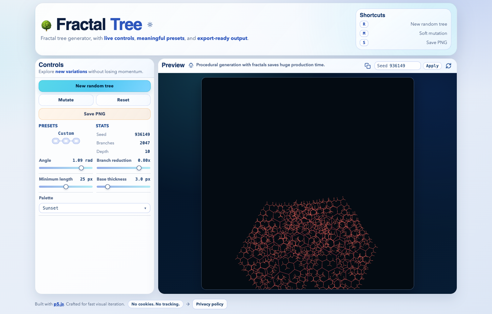
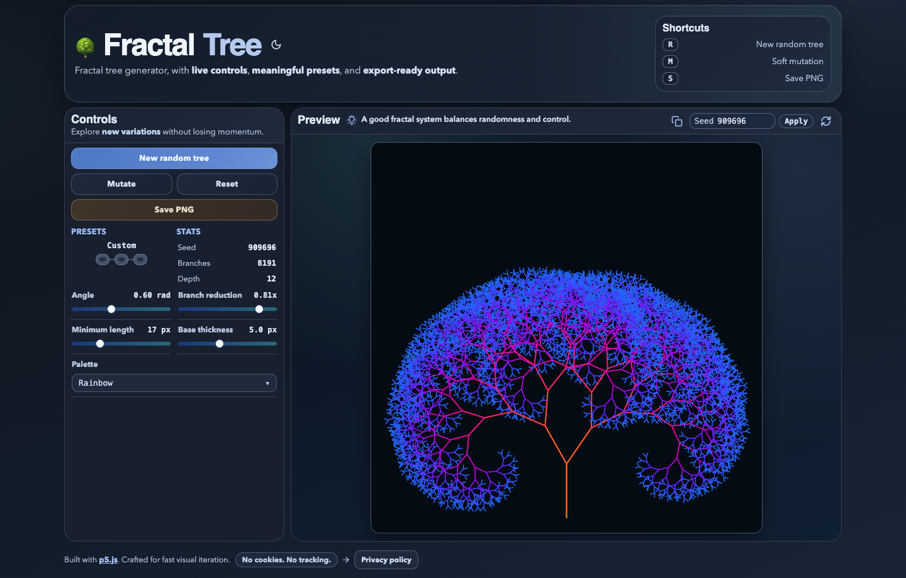

# Fractal Tree 🌳

[](https://p5js.org/)
[](./LICENSE)
[](https://fractal.gepser.dev/)

Fractal tree generator, with live controls, meaningful presets, and export-ready output.

## Screenshots 📸

| Light mode | Dark mode |
| --- | --- |
|  |  |

## Why this project is useful 🌱

- Instant visual feedback while tweaking core parameters.
- Deterministic seeds for reproducible results and easy sharing.
- Curated presets for fast starting points.
- One-click PNG export for moodboards, references, and social posts.
- Lightweight static app that runs fully in the browser.

## UI/UX walkthrough 🎨

- `Controls panel`: quick actions (`New random tree`, `Mutate`, `Reset`, `Save PNG`) plus sliders and palette.
- `Preset slider`: compact 3-state selector (`Classic`, `Dense`, `Minimal`) with animated label transitions.
- `Preview toolbar`: copy seed, apply seed, regenerate seed, and rotating fractal facts.
- `Micro-interactions`: short key flash feedback, icon state transitions, and temporary success states for copy/apply.
- `Theme toggle`: light mode by default with animated sun/moon icon transition.
- `Responsive behavior`: mobile layout hides shortcut hints and keeps controls readable.

## Keyboard shortcuts ⌨️

| Key | Action |
| --- | --- |
| `R` | Generate a new random tree |
| `M` | Apply a soft mutation |
| `S` | Save PNG |

## Fractal facts panel 💡

- The preview header includes a rotating fact line with **120 curated facts**.
- Facts are intentionally practical and inspiring (art, games, VFX, nature, design workflows).
- Click the bulb icon to get another fact instantly.

## Privacy model 🔒

- No cookies are set by the app.
- No analytics or tracking scripts are included.
- No app settings are written to `localStorage` or `sessionStorage`.
- Clipboard access only happens when the user clicks copy.
- Hosting is on Vercel, so standard request metadata can be processed at the platform layer.

## Run locally 🚀

No build step is required.

```bash
python3 -m http.server 4173
```

Then open [http://localhost:4173](http://localhost:4173).

## Quick QA checklist ✅

1. `New random tree` generates a different tree and seed.
2. `Mutate` changes style while keeping the current direction.
3. `Reset` returns to baseline defaults.
4. `Save PNG` downloads a rendered image.
5. `Apply` uses the typed seed.
6. Copy icon writes the current seed to clipboard and shows feedback.
7. Regenerate icon creates a new seed and animates.
8. Theme toggle updates all surfaces with accessible contrast.
9. Privacy modal opens and closes correctly.

## Project structure 📁

```text
.
├── index.html                # App markup + UI structure
├── sketch.js                 # p5 rendering + state + interactions
├── fractal-ui.css            # UI theme system + component styles
├── assets/vendor/p5.min.js   # Self-hosted p5 runtime
├── images/                   # README and showcase images
└── LICENSE
```

## Stack 🧰

- HTML
- CSS
- JavaScript
- [p5.js](https://p5js.org/)

## License 📄

MIT. See [`LICENSE`](./LICENSE).
